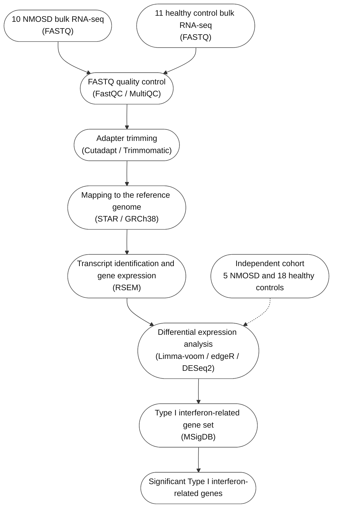

# Description

This repository contains the source code and analysis files for bulk RNA-seq analysis of neuromyelitis optica spectrum disorder (NMOSD) and healthy control samples. The workflow follows bulk RNA-seq processing through transcript quantification, differential expression analysis, and Type I interferon-related gene analysis.

## Dataset

The repository contains processed RNA-seq matrices, intermediate files, and analysis results in `RNA_DATA/`. Original sample-level data involve privacy-sensitive information and are not publicly available.

## Software Versions

The repository uses R scripts and PYTHON notebooks. Specific software, package, operating-system, editor, and server versions are not recorded in the repository.

## Analysis Workflow

The FASTQ quality-control, adapter-trimming, genome-mapping, and RSEM steps are represented in the workflow for completeness. The repository mainly contains the processed RSEM and STAR results used by the downstream analyses.

## Analysis Pipeline and Source Code

| Step | Description | Corresponding code |
|---|---|---|
| Bulk RNA-seq input | The main cohort contains 10 NMOSD and 11 healthy control samples. An independent cohort contains 5 NMOSD and 18 healthy controls. | `RNA_DATA/` |
| FASTQ quality control | Quality assessment of the FASTQ files. | FastQC and MultiQC (upstream tools; no script provided) |
| Adapter trimming | Removal of sequencing adapters. | Cutadapt and Trimmomatic (upstream tools; no script provided) |
| Mapping to the reference genome | Alignment to GRCh38. | STAR (upstream tool; no script provided) |
| Transcript identification and gene expression | Use RSEM and STAR results to construct expression matrices and calculate FPKM/TPM values. | `PYTHON/FPKM_TPM.ipynb`, `PYTHON/TPM_my_with_external_data.ipynb`, `PYTHON/No_3_genes_TPM_my_with_external_data.ipynb`, `PYTHON/rna_file.ipynb` |
| Independent cohort | Process the independent cohort for comparison with the main cohort. | `R/Limma_external.R`, `R/edgeR_external.R`, `R/DEseq2_external.R` |
| Differential expression analysis | Identify NMOSD-associated genes using Limma-voom, edgeR, and DESeq2. | `R/Limma.R`, `R/edgeR.R`, `R/DEseq2.R`, `R/Limma_external.R`, `R/edgeR_external.R`, `R/DEseq2_external.R` |
| Type I interferon-related gene set | Compare DEGs with Type I interferon and hallmark interferon gene sets. | `PYTHON/inteferon_geneset.ipynb`, the differential-expression scripts above |
| Significant Type I interferon-related genes | Integrate DEG results and classify shared up- and down-regulated genes. | `R/DEGs_analysis(3 packages).R`, `PYTHON/DEG_up_down.ipynb` |

Additional analysis files include PCA and batch-effect assessment (`R/log2cpm_PCA.R`, `R/TPM_PCA.R`, `R/Batch effect_PCA.R`), hierarchical clustering (`R/hirarchical_clustering.R`), cell-type deconvolution (`R/deconvolution_cell_type_bulk.R`), and functional enrichment analysis (`R/Pathway.R`).
