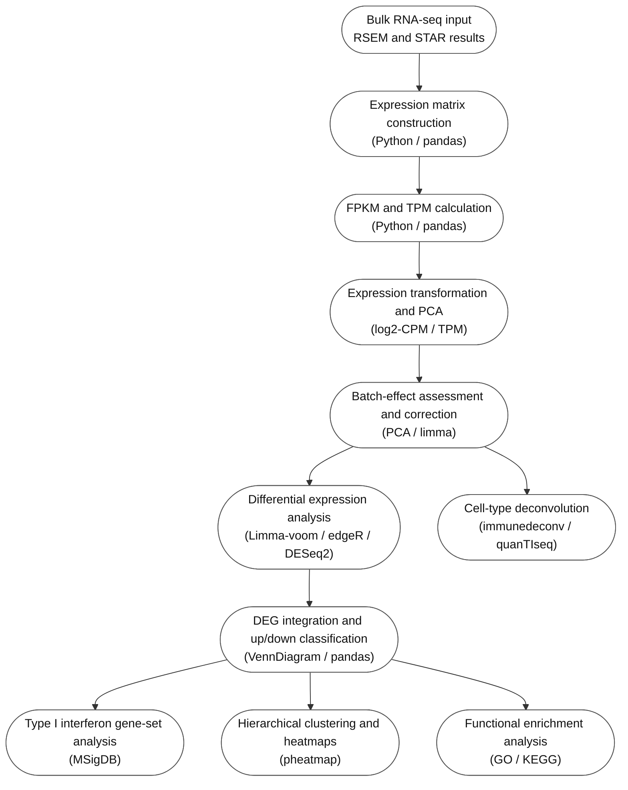

# Description

This repository contains the source code and analysis files for bulk RNA-seq analysis of neuromyelitis optica spectrum disorder (NMOSD) and healthy control samples. The workflow processes RSEM and STAR results, generates expression matrices, evaluates batch effects, identifies differentially expressed genes, and performs downstream interferon, clustering, cell-type deconvolution, and pathway analyses.

## Dataset

The repository contains processed RNA-seq matrices, intermediate files, and analysis results in `RNA_DATA/`. Original sample-level data involve privacy-sensitive information and are not publicly available.

## Software Versions

The repository uses R scripts and Python/Jupyter notebooks. Specific software, package, operating-system, editor, and server versions are not recorded in the repository.

## Analysis Workflow

## Analysis Pipeline and Source Code

| Step | Description | Source code |
|---|---|---|
| Input and matrix construction | Read RSEM and STAR results and construct gene-by-sample matrices. | `FPKM_TPM.ipynb`, `TPM_my_with_external_data.ipynb`, `No_3_genes_TPM_my_with_external_data.ipynb`, `rna_file.ipynb` |
| FPKM and TPM quantification | Calculate FPKM and TPM values and combine samples into expression matrices. | `FPKM_TPM.ipynb`, `TPM_my_with_external_data.ipynb` |
| Expression transformation and PCA | Transform expression values, generate log2-CPM/TPM matrices, and assess sample structure using PCA. | `log2cpm_PCA.R`, `TPM_PCA.R`, `pc1_elbow_method.ipynb`, `TPM_my_with_external_data.ipynb` |
| Batch-effect assessment and correction | Compare PCA results before and after batch-effect correction. | `Batch effect_PCA.R`, `log2cpm_PCA.R` |
| Differential expression analysis | Identify NMOSD-associated genes using Limma-voom, edgeR, and DESeq2 for the study and external datasets. | `Limma.R`, `edgeR.R`, `DEseq2.R`, `Limma_external.R`, `edgeR_external.R`, `DEseq2_external.R` |
| DEG integration | Compare DEG lists, classify up- and down-regulated genes, and identify intersections across analyses. | `DEGs_analysis(3 packages).R`, `DEG_up_down.ipynb` |
| Type I interferon gene-set analysis | Compare DEGs with Type I interferon and hallmark interferon gene sets. | `inteferon_geneset.ipynb`, the differential-expression scripts above |
| Hierarchical clustering and heatmaps | Visualize expression patterns of selected DEGs across samples. | `hirarchical_clustering.R` |
| Cell-type deconvolution | Estimate bulk RNA-seq cell-type composition. | `deconvolution_cell_type_bulk.R` |
| Functional enrichment analysis | Perform GO and KEGG enrichment analysis for selected gene sets. | `Pathway.R`, `DEGs_analysis(3 packages).R`, `log2cpm_PCA.R` |

